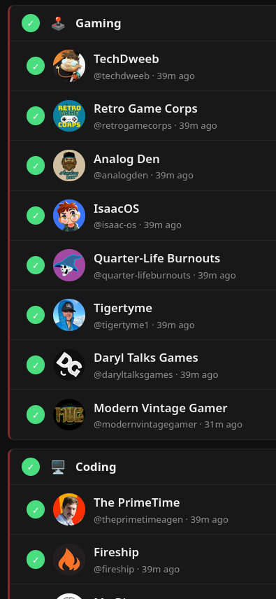
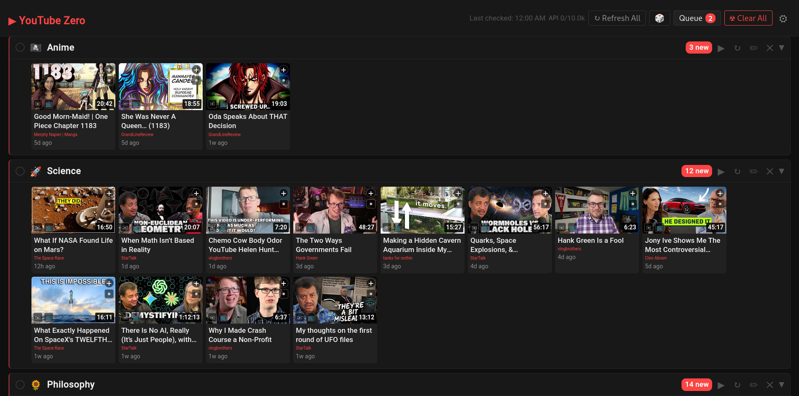

# YouTube Zero

Treat your YouTube subscriptions like an inbox, not a feed. 

- No algorithms
- No recommendations
- No endless scroll

Just a clear list of new videos from channels you chose.

Watch what matters, queue what you want, dismiss what doesn't. <u>When you're done, you're done.</u> The screen goes empty and stays that way.

## Features



- Add any YouTube channel by URL, `@handle`, or name
- Compact strip view — unread videos appear as tiles below each channel header by default, no clicking required
- **+** badge on every tile queues instantly; queue persists until watched or removed
- In-app video player with normal, theater, and fullscreen modes
- Keyboard shortcuts for fast navigation (see [Player](#player))
- Circle checkbox marks entire channel as read and collapses it
- Per-video read/unread toggle in tile and expanded list view
- Organize channels into folders; collapsed folder shows mixed tile strip
- Drag channels to reorder, or sort by newest video
- Auto-refresh on a configurable interval (5m – 24h)
- **Hide Shorts** — filters videos under 1m 40s from all views
- **☢ Clear All** — nuclear dismiss everything, queue untouched
- **Signal integration** — send any video or your full queue to Signal Notes to Self
- Real-time multi-client sync — all open tabs/devices update instantly on any change
- Dark theme, no JavaScript framework, no build step

<div style="clear: both;"></div>

---



## Quick start

### Local (venv)

```bash
python3 -m venv .venv
source .venv/bin/activate
pip install -r requirements.txt
uvicorn main:app --reload --port 8000
```

Open http://localhost:8000, click **⚙**, paste your API key.

### Docker

```bash
docker compose up -d --build
docker compose logs -f
```

Create `.env` next to `compose.yaml` so the API key loads automatically:

```
YOUTUBE_API_KEY=AIza...
```

Or use the provided `deploy.sh` helper (pulls latest, rebuilds, tails logs):

```bash
./deploy.sh
```

The database is saved to `./data/youtube_zero.db` on the host. The API key can also be set via the UI.

### Signal setup (optional)

The `compose.yaml` includes a `signal-api` sidecar ([signal-cli-rest-api](https://github.com/bbernhard/signal-cli-rest-api)).

1. Start the stack: `docker compose up --build`
2. Open **⚙ Settings**, enter your phone number, click **Link Device**
3. Scan the QR code in Signal → Settings → Linked Devices → Link New Device
4. Signal button appears on video tiles and in the queue

#### Signal commands (Note-to-Self)

Text any of these to yourself in Note-to-Self — the app listens and reacts.

| Command | Action |
|---------|--------|
| `/ping` | pong (connectivity test) |
| `/get` | send queued + visible unread videos (deduped) |
| `/queue` | send queue items only |
| `/refresh` | parallel refresh all channels, then `/get` |
| `/nuke` | mark all visible videos as read |
| `/undo` | make today's videos visible again |
| `/clear` | empty the queue |
| `/help` | list commands |

## YouTube API key

1. Go to [Google Cloud Console](https://console.cloud.google.com/apis/library/youtube.googleapis.com)
2. Enable **YouTube Data API v3**
3. Credentials → **Create credentials** → API key
4. (Optional) Restrict the key to YouTube Data API v3

Free quota: **10,000 units/day**.  
Cost: adding a channel ≈ 3 units, refreshing a channel ≈ 2 units.

## Usage

### Folders

| Action | How |
|--------|-----|
| Create folder | **📁 New Folder** button → enter name |
| Rename folder | Click **✏** on folder header |
| Delete folder | Click **✕** on folder header (channels move to root) |
| Move channel into folder | Use the folder **select dropdown** on the channel header |
| Move channel to root | Select **No folder** in the dropdown |
| Expand folder (show channels) | Click anywhere on folder header |
| Collapsed folder view | Mixed tile strip of all unread videos, newest first |
| Mark folder read | Click **✓ Mark Read** on folder header |

### Channels

| Action | How |
|--------|-----|
| Add channel | Type URL / `@handle` / name → **Add** |
| Queue a video | Click **+** badge on any tile |
| Unqueue | Click **✓** (green) on a queued tile or row |
| Expand full list | Click **▼** on channel header |
| Mark channel read | Click the circle ◎ left of the channel avatar |
| Mark channel unread | Click **↺** in the channel header |
| Mark video read (tile) | Click **✓** read button on tile |
| Refresh videos | **↻** per-channel or **↻ Refresh All** |
| Reorder channels/folders | Drag and drop (in manual order mode) |
| Sort by newest | Click **↕ Manual order** to toggle **↕ Newest first** |
| Nuclear clear | **☢ Clear All** — marks every channel read |
| Send to Signal | Click **✉** on any tile or video row |

### Expanded list view (click ▼)

| Action | How |
|--------|-----|
| Mark video read | Click ◉ (filled circle) next to the video |
| Mark video unread | Click ● (dim circle) on a read video |
| Play in app | Click the video thumbnail |
| Send to Signal | Click **✉** button on the video row |

### Queue

| Action | How |
|--------|-----|
| Play in app | **▶ Play** — opens the in-app player |
| Open in YouTube | **↗ YouTube** — opens new tab, marks watched |
| Remove | **Remove** — drops from queue without watching |
| Send to Signal | **✉ Signal** in queue header — sends all items one by one with previews |

### Player

| Action | How |
|--------|-----|
| Theater mode | **⬜ Theater** button or press **t** |
| Fullscreen | **⛶** button or press **f** |
| Open in YouTube | **↗** button or press **y** (closes player) |
| Send to Signal | Press **s** (closes player, sends with preview) |
| Mark watched & close | **✓ Watched** (only when playing from queue) |
| Close | **✕**, click backdrop, or press **Escape** |

### Auto-refresh

The header slider sets how often all channels refresh automatically:

| Setting | Interval |
|---------|----------|
| Off | Disabled |
| 5m – 24h | Configurable via slider |

Uncheck **Auto** to pause without changing the interval.

## Environment variables

| Variable | Default | Description |
|----------|---------|-------------|
| `YOUTUBE_API_KEY` | _(set via UI)_ | YouTube Data API v3 key |
| `DB_PATH` | `./youtube_zero.db` | SQLite database path |
| `SIGNAL_API_URL` | `http://signal-api:8080` | URL of signal-cli-rest-api sidecar |
| `REFRESH_INTERVAL_SECONDS` | `3600` | Background refresh interval; `0` to disable |

## Stack

- **Python 3.13** + FastAPI + SQLite
- Vanilla JS — no framework, no build step
- Server-Sent Events for real-time multi-client sync
- [uv](https://github.com/astral-sh/uv) for Docker dependency installs
- [signal-cli-rest-api](https://github.com/bbernhard/signal-cli-rest-api) for Signal integration (optional)
