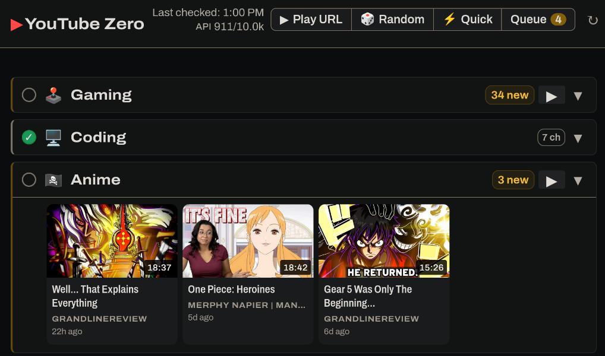
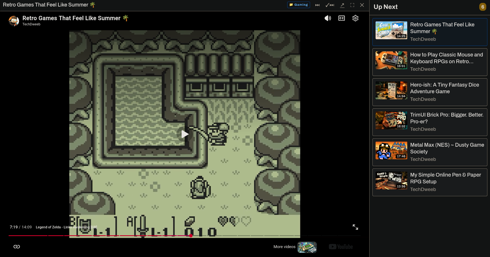
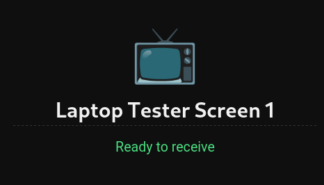
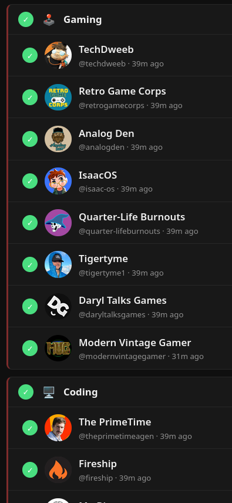

# YouTube Zero

Treat your YouTube subscriptions like an inbox, not a feed. 

- No algorithms
- No recommendations
- No endless scroll

Just a clear list of new videos from channels you chose.

Watch what matters, queue what you want, dismiss what doesn't. <u>When you're done, you're done.</u> The screen goes empty and stays that way.

---

## Screenshots

### Main Folder Interface


### Playing Queue


### Single Video, Playback actions


### Screen "casting" to /watch page



---

## Features



### Browsing

* Add channels via URL, `@handle`, or name
* Folders that collapse to a single row, or open to a mixed strip of everything unread
* Filter a folder down to one channel straight from a card
* **Browse / Manage modes** — add, rename, delete, mute and reorder stay out of the way until you ask for them
* Dark theme, no framework, no build step
* Real-time sync across tabs and devices

### Queuing

* Queue from a card's hover rail; a queued card shows its position in the watch order
* **Quick Queue** — click through cards to build a session playlist, then play it
* Queue survives bulk clearing; it only empties when you say so
* Per-video, per-channel and per-folder read toggles

### Playback (local & external)

* <b>Send to TV via Android developer bridge container</b>
* <b>Play on Screen — cast to a `/watch` display and drive it from your phone</b>
* <b>Server-delivered video — keeps playing when the phone is locked</b>
* <b>Audio mode — the same, audio only, for a fraction of the bandwidth</b>
* Embedded player with normal, theater and fullscreen modes
* Keyboard shortcuts throughout
* Shorts filtering (hides videos under 3 minutes)
* Signal integration for sending a video or the whole queue to "Notes to Self"

<div style="clear: both;"></div>

---

## Quick start

### Local (venv)

```bash
python3 -m venv .venv
source .venv/bin/activate
pip install -r requirements.txt
uvicorn main:app --reload --port 8000
```

Open http://localhost:8000, click **⚙**, paste your API key.

### Docker

```bash
docker compose up -d --build
docker compose logs -f
```

Create `.env` next to `compose.yaml` so the API key loads automatically:

```
YOUTUBE_API_KEY=AIza...
```

The database is saved to `./data/youtube_zero.db` on the host. The API key can also be set via the UI.

### Signal setup (optional)

The `compose.yaml` includes a `signal-api` sidecar ([signal-cli-rest-api](https://github.com/bbernhard/signal-cli-rest-api)).

1. Start the stack: `docker compose up --build`
2. Open **⚙ Settings**, enter your phone number, click **Link Device**
3. Scan the QR code in Signal → Settings → Linked Devices → Link New Device
4. **✉ Signal** appears in the queue, in every card's action menu (right-click or **⋯**), and in the mobile action sheet

#### Signal commands (Note-to-Self)

Text any of these to yourself in Note-to-Self — the app listens and reacts.

| Command | Action |
|---------|--------|
| `/ping` | pong (connectivity test) |
| `/get` | send queued + visible unread videos (deduped) |
| `/queue` | send queue items only |
| `/add <url>` | add a YouTube URL to the queue (channel not required to be subscribed) |
| `/play <url>` | play a YouTube URL on the TV (requires ADB-paired TV) |
| `/refresh` | parallel refresh all channels, then `/get` |
| `/nuke` | mark all visible videos as read |
| `/undo` | make today's videos visible again |
| `/clear` | empty the queue |
| `/dump` | move queue items back to unread (find original channel/video and unmark) |
| `/help` | list commands |

### Send to TV (Android TV via ADB)

The `compose.yaml` includes an `adb-api` sidecar that wraps `adb` for Android TVs.

1. On the TV: enable Developer Options → ADB debugging
2. In the app: **⚙ Settings** → enter TV LAN IP → **Save** → **Connect**
3. TV shows "Allow USB debugging from this computer?" — accept (key is stored)
4. **📺 Send to TV** appears in every card's action menu (right-click or **⋯**) and in the mobile action sheet
5. **Use SmartTube** (default on) routes via [SmartTube](https://github.com/yuliskov/SmartTube) (`com.liskovsoft.smarttubetv.beta`); off lets the TV's default YouTube app handle it

ADB keys persist via `./adb-data:/root/.android` so the trust prompt only shows once.

**"TV hasn't authorized this server."** The TV forgot the key — a factory reset,
a firmware update, or someone hitting *Revoke debugging authorizations*. Only
someone at the TV can clear it: accept the *Allow debugging?* dialog (tick
*Always allow*), or if no dialog appears, revoke authorizations on the TV and
retry. Before reporting this, `adb-api` restarts its local adb server and
reconnects once, which re-raises the dialog on a TV that merely dropped the
session — so a reboot generally recovers by itself.

### Play on Screen (cast to a /watch display)

Open `http://<host>:8000/watch` on any display — a spare monitor, an HTPC, a TV browser, or the
bundled Android app (`android-screen/`). It registers as a **screen** and waits. From your phone
at `/`, **📺 Play on Screen** sends a single video, a folder, or the whole queue to that screen,
and the phone becomes a remote: play/pause, seek, next/previous, mark-watched-&-next, captions,
fullscreen, and tap-to-jump through the playlist. Commands relay through the server over SSE —
nothing is streamed from the phone, the screen plays the YouTube embed itself.

If more than one screen is connected you pick which one; a single screen is auto-selected. The
screen reports what it's playing back to the remote, so the two stay in sync.

For a dedicated TV/monitor, build the WebView wrapper in `android-screen/` (see its README) — it
autoplays with sound, stays awake, and maps the remote's center button to play/pause.

#### Send to TV vs Play on Screen

Both put a video on another display, but they work differently:

| | 📺 Send to TV | 📺 Play on Screen |
|---|---|---|
| **How it reaches the display** | ADB tells the TV's YouTube/SmartTube app to open the video | A `/watch` page (browser or the Android app) plays the YouTube embed |
| **Setup** | ADB-paired Android TV + `adb-api` sidecar | Just open `/watch` on the display — no pairing |
| **After it starts** | Fire-and-forget; you control it with the TV's own remote | Your phone *is* the remote — play/pause, seek, queue, captions, fullscreen |
| **What you can send** | One video | A single video, a folder, or the whole queue |
| **Best for** | An Android TV you already drive with its remote | Any screen you want to control from your phone |

## YouTube API key

1. Go to [Google Cloud Console](https://console.cloud.google.com/apis/library/youtube.googleapis.com)
2. Enable **YouTube Data API v3**
3. Credentials → **Create credentials** → API key
4. (Optional) Restrict the key to YouTube Data API v3

Free quota: **10,000 units/day**.  
Cost: adding a channel ≈ 3 units, refreshing a channel ≈ 2 units.

## Usage

### Browse mode (the default)

The header carries the things you reach for constantly; everything that edits the
library lives behind **✎**.

| Control | Does |
|---------|------|
| **▶ Play URL** | Play a YouTube link without subscribing to the channel |
| **🎲** | Play a random unwatched video (**r**) |
| **⚡ Quick** | Selection mode — click cards to build a playlist, then play it (**Shift+Q**) |
| **Queue *n*** | Open the watch queue (**q**) |
| **↻** | Refresh all channels (**Shift+R**) |
| **⚙** | Settings — API key, Signal, TV, watch history |
| **✎** | Switch between Browse and Manage |

### Folders and channels

| Action | How |
|--------|-----|
| Collapse / reopen a folder | Click the folder row |
| Show the channels inside a folder | **▼** on the folder row |
| Filter a folder to one channel | Click the channel name at the bottom of any card; click again to clear |
| Play a folder | **▶** on the folder row — oldest first, and only what's visible if a filter is on |
| Mark a folder read | **✓** on the folder row (respects an active filter) |
| Play a video | Click the thumbnail |
| Queue a video | Hover a card → **+ Queue**. Queued cards show their queue position |
| Mark a video read | Hover a card → **✓ Done** |
| Send to TV, a screen, Signal or the clipboard | Right-click a card, or **⋯** on the hover rail |
| Show a channel's full list, reads included | **▼** on the channel row |
| Mark a channel read | **✓** left of the channel avatar |

With a screen online, **▶** asks where and in what order — play here or on the
screen, oldest first or newest first. With no screen it just plays here, oldest
first; hold **Shift** for newest first.

### Manage mode (**✎**)

| Action | How |
|--------|-----|
| Add a channel | Type URL / `@handle` / name → **Add** |
| Create, rename or delete a folder | **📁 New Folder**, or **✏** / **✕** on a folder row |
| Move a channel between folders | Folder dropdown on the channel row |
| Mute a channel | **🔊** on the channel row — hides its videos, auto-reads new ones |
| Mark a channel unread | **↺** on the channel row |
| Refresh one channel or folder | **↻** on its row |
| Reorder channels and folders | Drag the rows |
| Clear everything | **☢ Clear All** — marks every channel read, queue untouched |

### Queue and player

| Action | How |
|--------|-----|
| Play a queued video | **▶ Play** |
| Open in YouTube | **↗** or press **y** — marks watched |
| Remove from queue | **Remove** |
| Send the whole queue to Signal | **✉ Signal** in the queue header |
| Audio only (survives a screen lock) | **🎧** or press **a** — see below |
| Theater mode | **⬜** or press **t** |
| Fullscreen | **⛶** or press **f** |
| Send to Signal | Press **s** |
| Mark watched and close | **✓ Watched** (when playing from the queue) |
| Close the player | **✕**, click the backdrop, or press **Escape** |

### Server-delivered video (default on)

With `SERVER_VIDEO=1` the player is a same-origin `<video>` fed by the server
instead of the YouTube embed, and **video keeps playing when the app is
backgrounded or the screen locks** — no switch to audio needed.

YouTube delivers anything above 360p as separate video and audio streams, so
`ffmpeg` remuxes them back together on the fly. It's a stream copy, not a
transcode: full 1080p H.264 out, no quality loss, no encoding cost.

What it costs:

* **ffmpeg per concurrent viewer**, and the full video bitrate over your uplink
  (~0.7–3 Mbps, versus ~0.1 for audio mode).
* **Seeking restarts the stream** at the new position. A generated stream has no
  byte ranges to seek within, so the player asks the server to begin again at
  that offset and keeps its own timeline. Expect a pause while it catches up —
  the scrubber's dim bar shows how far the remux has got.
* **No captions.** They live in the YouTube player, which isn't involved. The
  cast remote greys the CC button out when a screen is on a server stream.
* Everything else works: the cast remote, play-here, transfer-to-screen and the
  TV D-pad all drive whichever player is live.

Set `SERVER_VIDEO=0` to go back to the YouTube embed plus the audio-mode
switchover described below. That path stays fully functional, and is also the
automatic fallback whenever a remux isn't possible — you'll see a brief
"using the YouTube player" message when that happens.

**Per-device opt-out.** Whether the box will remux is server-wide — it's the box
doing the work — but any single client can decline and use the embed instead:

* `?server_video=0` on any page, remembered in that browser's `localStorage`
  from then on. `?server_video=auto` clears it and goes back to following the
  server.
* **⚙ Settings** → *…use it on this device*, the same switch with a checkbox.

The TV APK's URL carries `?server_video=0`, so a TV always gets the embed. It
never backgrounds a player, so it gains nothing from server delivery, and the
embed brings captions the remux can't. Note the opt-out is one-way: a client
can't turn server video *on* when the server has it off, because the endpoints
aren't there to call.

### Audio mode

Press **🎧** in the player (or **a**) to drop the video and play audio only. The video is
replaced by a now-playing panel — artwork, scrubber, prev/play/next — and playback
**continues when the screen is off or the app is backgrounded**, with working lockscreen
controls. In the Android app it switches over automatically when you background it.

The YouTube embed cannot do this: Chromium suspends the iframe the moment the page is
hidden. Audio mode feeds a same-origin `<audio>` element from `/api/audio/<video_id>`,
which the server resolves with yt-dlp and proxies. See `PROSPECTS.md` for the measurements.

The setting is per-browser and sticky. It never engages on `/tv` or a cast receiver —
those are screens someone is looking at.

Worth knowing:

* **Views don't count.** Playback never touches YouTube's counters, so creators get nothing.
* **No captions, chapters, or video** while it's on.
* **The server carries the audio** — about 20 MB per 30 minutes, per listener.
* **yt-dlp breaks periodically** when YouTube changes their player. Audio mode falls back
  to the video player when it does, so a breakage costs background playback, not playback.
  Fixing it means bumping `yt-dlp` in `requirements.txt` and rebuilding.
* **Needs `www.youtube.com`.** If your DNS blocks it (Pi-hole, AdGuard), the server can't
  resolve streams — see the `dns:` note in `compose.yaml`.
* Set `AUDIO_MODE=0` to disable the endpoints entirely.

### On a phone

Cards are two-up, folders start collapsed, and tapping a card opens an action
sheet instead of a hover rail — play here, send to TV or a screen, queue, mark
read, share. In the player the title takes the top of the screen and the
controls sit in a full-width bar at the bottom.

### Other pages

| Path | What it is |
|------|------------|
| `/watch` | Idle screen — waits to be cast to. See *Play on Screen* above |
| `/watch/queue` | Play straight through the queue on this device |
| `/tv` | Locked-down browse for a TV: D-pad navigable, no editing controls |
| `/phone` | `/tv` for a handset — no auto-fullscreen, queue below the video |
| `/history` | Everything you've started watching, searchable by title, channel or folder |

Channels also refresh on their own in the background — see
`REFRESH_INTERVAL_SECONDS` below.

## Environment variables

| Variable | Default | Description |
|----------|---------|-------------|
| `YOUTUBE_API_KEY` | _(set via UI)_ | YouTube Data API v3 key |
| `DB_PATH` | `./youtube_zero.db` | SQLite database path |
| `SIGNAL_API_URL` | `http://signal-api:8080` | URL of signal-cli-rest-api sidecar |
| `REFRESH_INTERVAL_SECONDS` | `3600` | Background refresh interval; `0` to disable |
| `SERVER_VIDEO` | `1` | Serve video from the server via ffmpeg remux; `0` uses the YouTube embed |
| `SERVER_VIDEO_MAX_HEIGHT` | `1080` | Cap the rendition picked for remuxing |
| `AUDIO_MODE` | `1` | Enable `/api/audio` (yt-dlp background audio); `0` disables |
| `AUDIO_CACHE_TTL` | `10800` | Seconds to cache a resolved stream URL (they last ~6h) |

## Stack

- **Python 3.13** + FastAPI + SQLite
- Vanilla JS — no framework, no build step
- Server-Sent Events for real-time multi-client sync
- [uv](https://github.com/astral-sh/uv) for Docker dependency installs
- [signal-cli-rest-api](https://github.com/bbernhard/signal-cli-rest-api) for Signal integration (optional)
